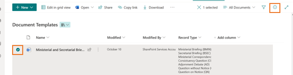
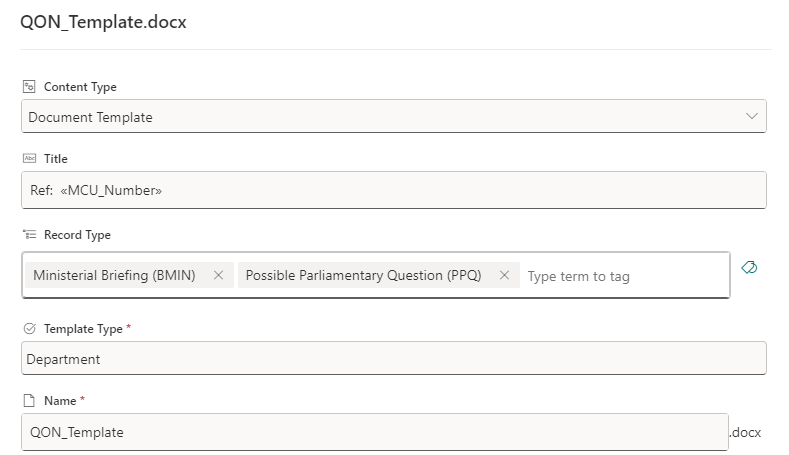
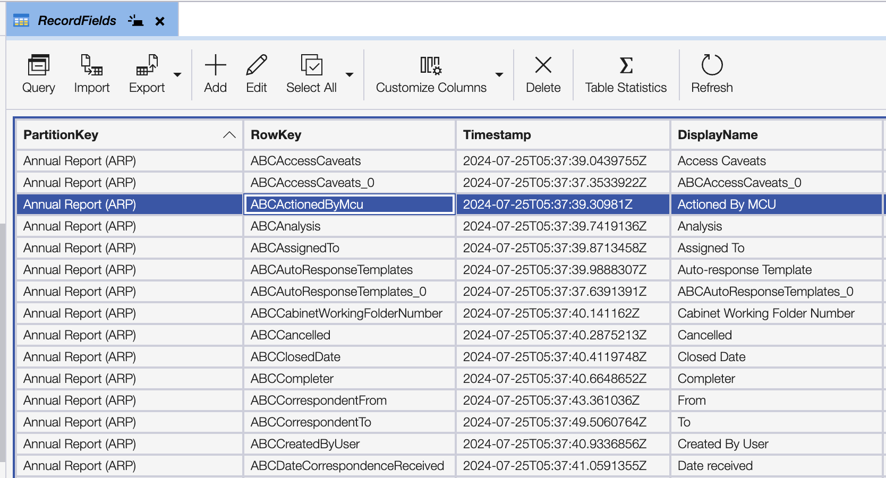
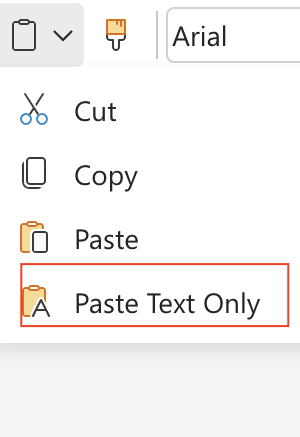

##Templates

As a system administrator, you can prepare a number of templates and assign them to record types so that users creating and modifying corresponding records can create documents based on those templates.

##Adding new templates
 
To add a template:

* Go to the appropriate SharePoint site.
* Open the Document Templates library.
* Upload a new document.
* Select the new template and click the Details button in the action panel.

* Apply the appropriate properties to the document.
  * Ensure you select the record type(s) the document should appear in.
  * Ensure you select 'Department' in Template Type.

##Using placeholders
The token replacement feature is used to display the values of the current record when generating a Word document from a template. Tokens can be used in the document body, header, and footer. All fields from the record are available for use.

You can find the list of fields in the RecordFields table in Azure Storage.

To create a proper token, use the following pattern: TOKENSTART.DisplayName.TOKENEND.

###Using complex type placeholders
Complex types are reduced to simple ones by declaring the desired field in the complex type. For example, for the User type, if you want to display the user's job title, you need to add a dot (.) after the field's internal name and then add the internal name of the property in your complex type.

In this example, the token for the user's job title will look like TOKENSTART.DisplayName.JobTitle.TOKENEND.

###Example

###Known Issues
Sometimes Word documents split text into different areas, and we cannot replace tokens because they appear similar to the example below:

`<w:t>{{</w:t></w:r><w:proofErr w:type="spellStart" /><w:r w:rsidRPr="6B422EAB" w:rsidR="03D9220A"><w:rPr><w:rFonts w:ascii="Calibri" w:hAnsi="Calibri" w:eastAsia="Calibri" w:cs="Calibri" /><w:b w:val="0" /><w:bCs w:val="0" /><w:i w:val="0" /><w:iCs w:val="0" /><w:caps w:val="0" /><w:smallCaps w:val="0" /><w:noProof w:val="0" /><w:color w:val="000000" w:themeColor="text1" w:themeTint="FF" w:themeShade="FF" /><w:sz w:val="21" /><w:szCs w:val="21" /><w:lang w:val="en-US" /></w:rPr><w:t>DecisionMaker.Mail</w:t></w:r><w:proofErr w:type="spellEnd" /><w:r w:rsidRPr="6B422EAB" w:rsidR="03D9220A"><w:rPr><w:rFonts w:ascii="Calibri" w:hAnsi="Calibri" w:eastAsia="Calibri" w:cs="Calibri" /><w:b w:val="0" /><w:bCs w:val="0" /><w:i w:val="0" /><w:iCs w:val="0" /><w:caps w:val="0" /><w:smallCaps w:val="0" /><w:noProof w:val="0" /><w:color w:val="000000" w:themeColor="text1" w:themeTint="FF" w:themeShade="FF" /><w:sz w:val="21" /><w:szCs w:val="21" /><w:lang w:val="en-US" /></w:rPr><w:t>}}</w:t>`

The easiest way to avoid this issue is to copy and paste the entire token as plain text.

