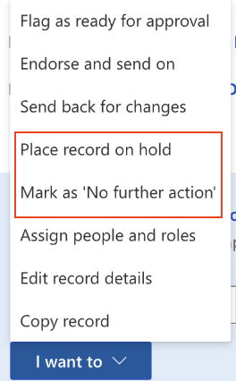
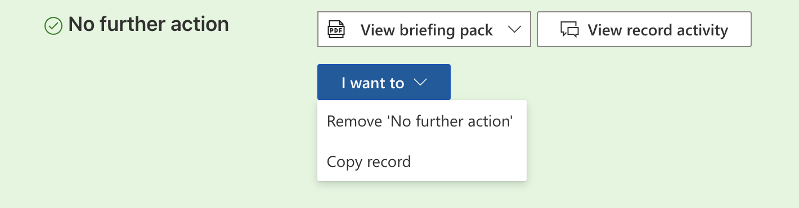

##Controls
In Brief Connect, there are four controls that can be set for each record.

The controls are:
* Withdrawn
* Cancelled
* No Further Action
* On Hold

##Applying flags to a record
If the user has a CanCancelRecord flag assigned to them, they can choose "Cancel record" from the 'I want to' dropdown.

If the user has a CanTakeNoFurtherAction flag assigned to them, they can choose "No further action" from the 'I want to' dropdown.

If the user has a CanWithdrawRecord flag assigned to them, they can choose "Withdraw" from the 'I want to' dropdown.

If the user has a CanPlaceRecordOnHold flag assigned to them, they can choose "Place record on hold" from the 'I want to' dropdown.

##Removing flags from a record
When any of the controls are added to a record, the record is suspended without the possibility of changing record state.

Administrators or users with the appropriate flag can remove the control from the record. Once they do that, the record is put back to the same state it was in before the control was applied.

 
 

System Administrators can define who can use these controls within the records. For more information see: [Granting access to flow controls](./Granting-access-to-flow-controls.md)