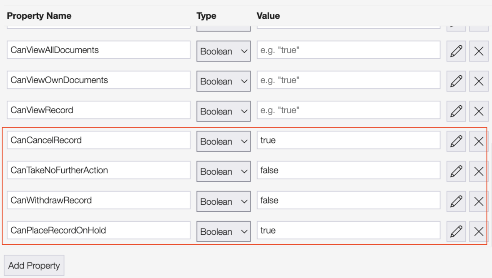

##Controls
To learn about controls see: [Flow Controls](./Flow-Controls.md)

##Granting permissions for using controls

To grant permissions for users to use any of the controls, admins must go to the PermissionsSet table and create the appropriate permission set.

The controls to be defined are:

* **CanCancelRecord** -> for record cancellation
* **CanTakeNoFurtherAction** -> for marking the record as no further action
* **CanWithdrawRecord** -> for marking the record as withdrawn
* **CanPlaceRecordOnHold** -> for placing the record on hold

Once the Permission Set is configured, the permissions need to be granted through the RoleAssignments table. 