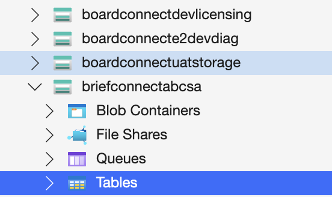
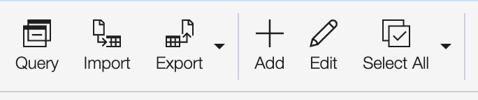

This guide explains how to configure Organisations in Brief Connect using the Azure Storage Explorer application. Follow these steps to set up Organisations level 1-4.

## Before you begin, ensure you have:
*   Write access to the Storage Account in Azure where Brief Connect is deployed
*   Azure Storage Explorer installed on your device

### 1. Open Azure Storage Explorer

Launch Azure Storage Explorer on your device.

### 2. Connect to Your Storage Account
1.  In Azure Storage Explorer, click on the "Connect" button (plug icon) in the left sidebar
2.  Select "Storage account or service"
3.  Choose one of the following connection methods:
    *   **Connection string**: Select "Connection string (key or SAS)" and paste your storage account connection string
    *   **Azure login**: Select "Azure" and sign in with your Azure credentials
4.  Click "Next"
5.  Click "Connect"

### 3. Navigate to Tables

1.  In the left navigation pane of Azure Storage Explorer, find and expand your storage account.
2.  Click on **Tables** to display all available tables.

3. Select the **organization** table to open it.

## Setting up the Organisation Structure

In the **organization** table, you will define your organisation’s structure. This structure can include up to four cascading levels.

#### Define the Root Level

1.  To begin, define the Root level, which will appear in the “Organisation Level 1” dropdown in Brief Connect.
    
2.  Click **+Add** at the top of the screen.

3. A pop-up will appear:

In the pop-up:
*   Set the **PartitionKey** to “Root”.
*   Enter a unique **RowKey** (GUID).
*   Specify the **Name** you want displayed in Brief Connect (e.g., “Head Office”).
Example:

#### Define the Second Level

1.  Once the Root level is set, you can proceed to create the second level, which will appear in the “Organisation Level 2” dropdown.

For each entry:
*   Set the **PartitionKey** to the **RowKey** of the Organisation Level 1 entry created in the previous step.

Example:

_Note that PartitionKey in this screenshot is the same as RowKey in the previous screenshot._

#### Define Levels 3 and 4

Repeat this process for each subsequent level. For each new level, set the **PartitionKey** to the **RowKey** of the previous level’s entry.
