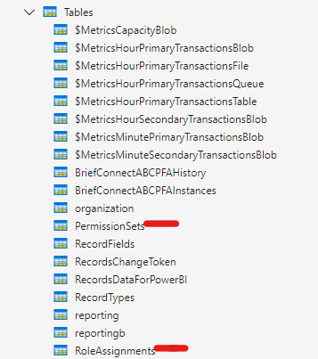

This guide explains how to configure permissions in Brief Connect using the Azure Storage Explorer application. Follow these steps to set up Permission Sets and Role Assignments to manage user access to records effectively.

[[_TOC_]]

## Before you start

Before you begin, ensure you have:

* Write access to the Storage Account in Azure where Brief Connect is deployed
* Azure Storage Explorer installed on your device

## Configure Permissions in Brief Connect

### 1. Open Azure Storage Explorer

Launch Azure Storage Explorer on your device.

### 2. Connect to Your Storage Account 

1. In Azure Storage Explorer, click on the "Connect" button (plug icon) in the left sidebar
2. Select "Storage account or service"
3. Choose one of the following connection methods:
   - **Connection string**: Select "Connection string (key or SAS)" and paste your storage account connection string
   - **Azure login**: Select "Azure" and sign in with your Azure credentials
4. Click "Next"
5. Click "Connect"

### 3. Navigate to Tables

1. Expand your storage account in the left navigation pane
2. Expand "Tables" to view all tables

### 4. Manage Permission Sets and Role Assignments

You will see a list of tables corresponding to your Brief Connect instance. The two relevant tables for configuring permissions are the **PermissionSets** Table and the **RoleAssignments** Table.

A Permission Set is a collection of individual permissions that control what actions a user can perform in Brief Connect. Each permission is a simple true/false (boolean) flag that either grants or denies access to a specific capability, such as viewing records or editing documents.

Role Assignments are used to assign a Permission Set to users based on targeting rules. The targeting rules can filter users through mechanisms like Entra ID Group membership or specific email addresses, and can filter records through attributes like Record Type, Metadata values, or Workflow Stage.

For example, you could create a Role Assignment that:
- Grants the "Read Only" Permission Set
- To all users in the "Finance Team" Entra ID Group 
- For all records with Record Type "Invoice"

This flexible rules engine allows System Administrators to create sophisticated permission schemes that match their organisation's business processes and compliance requirements.

#### Permission Sets Table

Permission Sets are stored in the Permission Sets table, where administrators can create and modify them based on their organisation's needs. When a user is assigned a Permission Set through Role Assignments, Brief Connect checks these individual permissions whenever the user attempts to perform an action.

For example, a "Read Only" Permission Set might have viewing permissions for a record enabled but editing permissions disabled, while a "Full Access" Permission Set might enable all permissions. 

The Permission Sets table contains the following individual permissions that can be enabled or disabled:

| Permission | Description |
|------------|-------------|
| CanViewRecord | Controls whether the user can view the basic record information (i.e. open the details page for a Record) |
| CanEditRecordMetadata | Controls whether the user can edit record metadata (note: this includes all fields on the Record Details page. Brief Connect does not currently support limiting which fields can be edited - or 'field-level' permissions) |
| CanViewAllDocuments | Controls whether the user can view all documents on a record |
| CanAddDocuments | Controls whether the user can add new documents |
| CanEditDocuments | Controls whether the user can edit documents (editing record content, as well as renaming and reordering documents) |
| CanDeleteDocuments | Controls whether the user can delete documents |
| CanUploadSignedDocuments | Controls whether the user can upload signed versions of documents |
| CanUploadSupportingDocuments | Controls whether the user can upload supporting documentation (note: this is a useful flag if you want to allow users to upload documents to only the Supporting Documents category. If this is your intention, then the user must not inherit the 'CanAddDocuments' permission as it will override this flag) |
| CanCreateBrief | Controls whether the user can create new records - this flag must be paired with a Role Assignment that targets permissions on a record type-basis (e.g. activates on a 'Ministerial Correspondence' record type) |
| CanCancelRecord | Controls whether the user can cancel records |
| CanPlaceRecordOnHold | Controls whether the user can place records on hold |
| CanTakeNoFurtherAction | Controls whether the user can mark records as requiring no further action |
| CanWithdrawRecord | Controls whether the user can withdraw records |

If a property/field hasn't be defined for a Permission Set, it will inherit a default value of `'false'`.

##### Add a New Permission Set

1. Click the **+ Add entity** button at the top of the PermissionSets table.

  

2. Fill in the required fields:
   - **PartitionKey**: Set this to `'Basic'`.
   - **RowKey**: Enter a name of your choice for the permission set, e.g., `'ReadOnly'`.

  

3. Assign `'true'` or `'false'` values to each property based on the desired permissions. Ensure the **Type** field remains set to `'Boolean'` for all properties.

4. After configuring the permission set, click **Insert** to save. To edit an existing permission set, double-click or right-click and select **Edit**.

#### Role Assignments Table

The Role Assignments table allows you to create and modify roles linked to specific permission sets. A Role Assignment is like a collection of rules that combine together to determine the subset of users that should inherit a given Permission Set. 

 Each role assignment has the following properties:

| Property | Description | Mandatory | Examples | Default Value | Field Type |
|----------|-------------|-----------|-----------|--------------|------------|
| PartitionKey | Accepts a comma-separated list of record types. The RoleAssignment will only apply to Record Types specified in this field.   This is the same name as the Content Type within SharePoint Online for the Record Type. *Alternatively, set the value to 'All' to apply the role assignment to all record types* | Yes | Cabinet Submission (CSUB),Correspondence,Ministerial Correspondence (CMIN) | None | String |
| RowKey | A unique identifier for the Role Assignmnet. Commonly used to summarise the role assignment for clarity | Yes | COR - AO - EDIT COR - LA - READ CSUB - Full Access BMIN - Full Access BSEC - Full Access | None | String |
| Description | A detailed description of the role assignment for clarity | No | Provides edit access for Accountable Officers on Correspondence records. This helps identify the purpose when reviewing role assignments later. | None | String |
| PermissionSet | The name of a single permission set from the PermissionSets table to be allocated to the role. Each role assignment can only have one permission set. | Yes | ReadOnly | None | String |
| RecordRoleNames | Accepts a comma-separated list of record role display names that this assignment applies to, or 'All' to apply the role assignment to all roles. Must exactly match the role names configured in the content type settings for the record type(s). Also see [Special Rules for RecordRoleAssignments](#special-rules-for-recordroleassignments) | No | Accountable Officer,Lead Author | All | String |
| Stages | Accepts the name of the workflow stages this assignment applies to, or 'All' to apply the role assignment to all stages. Must exactly match the stage names configured in the workflow settings for the record type(s) | No | None | All | String |
| AADGroupNames | A comma-separated list of Azure AD groups this assignment applies to | No | SG_Finance_Team | None | String |

> **Note:** The fields **ForFieldValues** and **Organisations** are to be updated as per your organization's requirements.

Each property within a Role Assignment further refines the scope of the Role Assignment.

For example, a Role Assignment might be configured to grant the "Read Only" Permission Set to all users in the "Finance Team" for all "Correspondence" records. You would achieve this by setting the following values:

- **PartitionKey**: `'Correspondence (Cor)'`
- **RowKey**: `'COR - Full Access'`
- **Description**: `'Grants read only access to all Correspondence records for the Finance Team'`
- **PermissionSet**: `'ReadOnly'`
- **AADGroupNames**: `'SG_Finance_Team'`

This Role Assignment will be inherited by all users in the "Finance Team" Entra ID Group for all "Correspondence" records. The "ReadOnly" Permission Set would apply to all workflow stages of the Correspondence record.

##### Add a New Role Assignment

1. Click the **+ Add entity** button above the RoleAssignments table.

   

2. Provide the required details for the role assignment, including **PartitionKey**, **RowKey**, **Description**, and select the appropriate **PermissionSet**.

   {**Assumption:** Additional fields such as **RecordRoleNames**, **Stages**, and **AADGroupNames** should be filled based on your organisation's specific roles and requirements.}

3. After entering all necessary information, click **Insert** to save the new role assignment.

#### Permission Recalculation

Each time a user requests a record (i.e.: via opening the Record Details page), Brief Connect will recalculate the user's permissions based on the Role Assignments they are assigned to. This ensures that users can only access records that they are explicitly assigned to and perform actions they are explicitly granted permission to.

#### Multiple Role Assignments

Brief Connect supports multiple Role Assignments for a given user. This allows you to create complex permission schemes that combine multiple Permission Sets and targeting rules.

All Permission Sets assigned to a user are combined together, with the most permissive settings taking precedence. For example, if a user inherits two Role Assignments:

- One that grants "Full Access" permissions with the following flags:
  - CanViewRecord = true
  - CanEditRecordMetadata = true
  - CanViewAllDocuments = true
  - CanAddDocuments = true
  - CanEditDocuments = true
  - CanDeleteDocuments = true
- One that grants "Read Only" permissions with the following flags:
  - CanViewRecord = true

The total permissions granted to the user will be:

- CanViewRecord = true
- CanEditRecordMetadata = true
- CanViewAllDocuments = true
- CanAddDocuments = true
- CanEditDocuments = true
- CanDeleteDocuments = true

#### Special Rules for RecordRoleAssignments

The **RecordRoleNames** field is used to specify which roles within a record type should inherit the Permission Set. In addition to supporting specific role names and the value 'All', it also supports a special set of values that can be used to target permissions at roles in a more dynamic way.

The special values are:

| Description | Value |
|------------|-------|
| Named users from department roles (i.e. not the Decision stage roles), including the Initiator role | DepartmentInclInitiator |
| Named users from department roles (i.e. not the Decision stage roles), **but excluding** the Initiator role | DepartmentExclInitiator |
| Named users from roles in the Decision stage | Decision |
| Named users from roles in the Decision stage, **but excluding** the DLO role | DecisionExclDLO |
| Named users from all roles including aux roles | AllIncludingViewOnlyCreatedByEtc |
| Named users from initiator role | Initiator |
| Named users from DLO role | DLO |
| Users who are actively assigned a task within the workflow for the record  *(e.g. if John Doe is an Accountable Officer on a Correspondence record, and is assigned the task of "Prepare first draft", by setting this value to "AssignedTo", the "Read Only" Permission Set will be granted to John Doe for the duration of the task. The Lead Author role can also be reassigned to another user, in which case the "Read Only" Permission Set will no longer be granted to John Doe)* | AssignedTo |

## See also

- [Azure Storage Explorer](https://azure.microsoft.com/en-us/products/storage/storage-explorer/) - For managing Role Assignments and Permission Sets directly in Azure Storage Tables
- [Azure Active Directory Groups](https://portal.azure.com/#blade/Microsoft_AAD_IAM/GroupsManagementMenuBlade/AllGroups) - For managing AAD Groups referenced in Role Assignments
