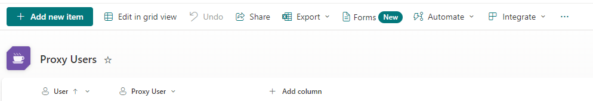
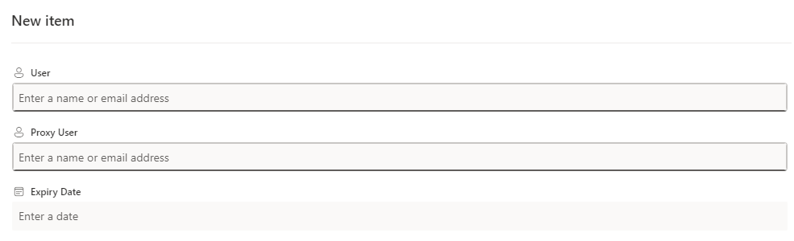
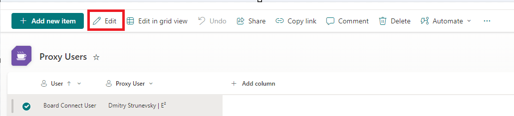
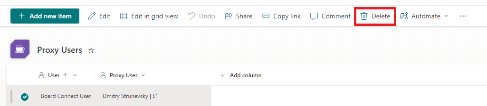

##Proxies
When a proxy is assigned to a user, they can filter the dashboard to their executives view and complete actions on their behalf.
 
##Managing proxies
To find a list of proxies:
- Go to the Brief Connect SharePoint Online site
- Go to the Site Contents
- Go to the ‘Proxy Users’ list
- In the list you can see all the users who have proxies assigned.

###Adding a new Proxy
- Go to the ‘Proxy Users’ list
- Click '+ Add new item'

- Select a user and choose their proxy
- Add an expiry date to the proxy assignment. On this date, the proxy will be removed

- Click Save

###Editing a Proxy
- Go to the ‘Proxy Users’ list
- Select the line item that you want to edit
- Click Edit in the action bar

###Deleting a Proxy
- Go to the ‘Proxy Users’ list
- Select the line item that you want to delete
- Click Delete in the action bar

