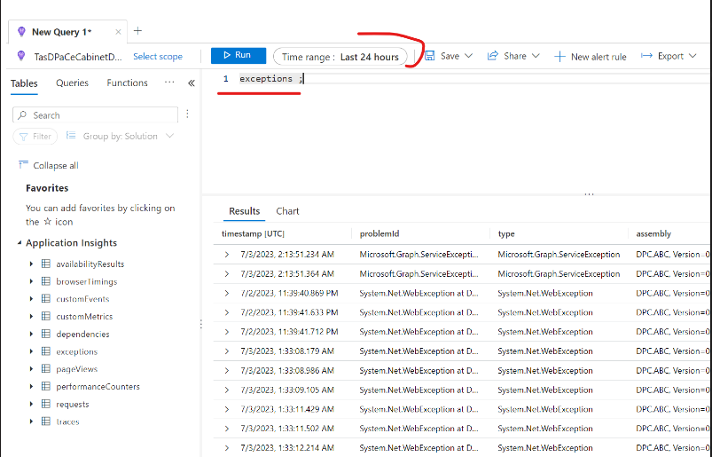

App Insights is a service that provides monitoring and analytics for our app. It helps us track the performance, availability, usage, and errors of our app. We can use App Insights to debug our app by following these steps:

1. Log in to the Azure portal and navigate to the resource group BriefConnect-DEV (or other target environments).
2. Select the App Insights resource BriefConnectDEV-AI from the list of resources.
3. On the overview page, you can see various metrics and charts that show the health and activity of our app. You can also customize the dashboard by adding or removing tiles, changing the time range, or applying filters.
4. To view the detailed logs of our app, click on Logs from the left menu. This will open a query editor where you can write and run queries using the Kusto query language.
5. You can use the traces table to view the regular log records of our app. For example, you can run this query to see the traces from the last 24 hours:
```
traces
| where timestamp > ago(24h)
| order by timestamp desc
```
6. You can use the exceptions table to view the exceptions that occurred in our app. For example, you can run this query to see the exceptions from the last 24 hours:
```
exceptions
| where timestamp > ago(24h)
| order by timestamp desc
```



7. You can also use other tables and functions to query different aspects of our app, such as requests, dependencies, custom events, availability results, etc. You can find more information about the schema and syntax of App Insights queries here: https://docs.microsoft.com/en-us/azure/azure-monitor/log-query/log-query-overview
8. To debug a specific issue or scenario, you can use the search feature to find and filter relevant events across all tables. You can also use the application map to visualize the dependencies and failures of our app. You can find more information about how to use App Insights for troubleshooting here: https://docs.microsoft.com/en-us/azure/azure-monitor/app/app-insights-troubleshoot-faq