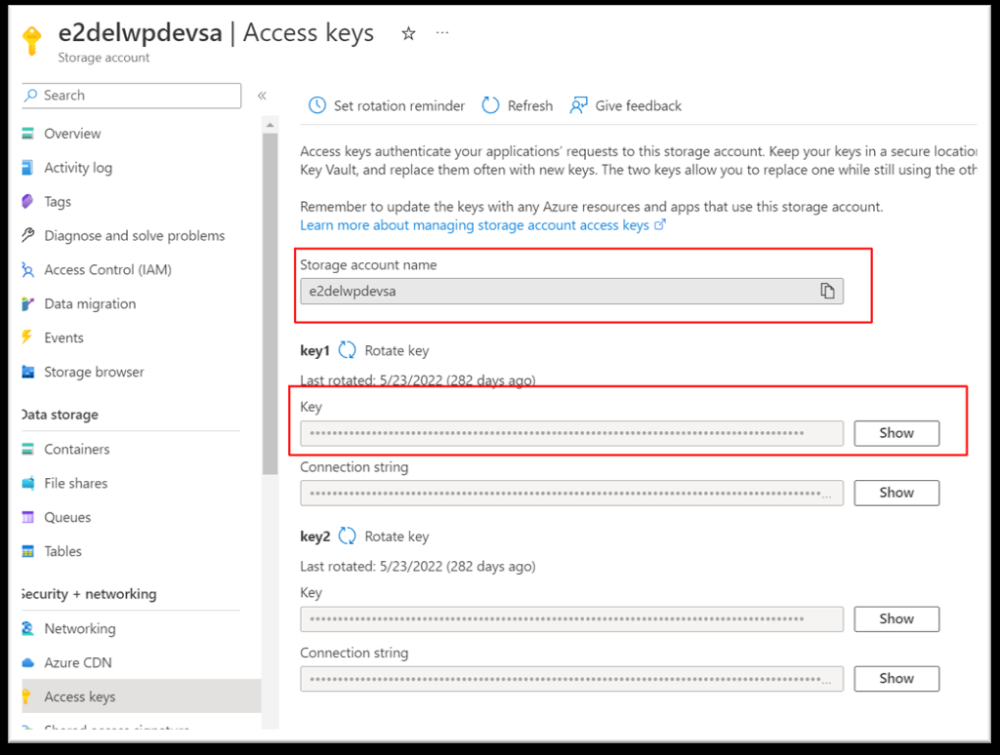

To create Power BI dataflow, dataset, and report, we need to get an access key to the Azure tables. To do this, we need to log in to the Azure Portal where BMCP application is deployed and navigate to the appropriate resource group. Below are the Steps with an example on a Dev environment.

1. Open BMCP app resource group in Azure
2. Open **Storage account** resource
3. Open "Access keys" on left menu
4. Copy "Storage account name" and "key1"

