1. Open <https://app.powerbi.com/home>  with Service account
2. Click on "Workspaces" and create new workspace. Name it with environment related name, for example BMCP – \[Environment] Workspace.
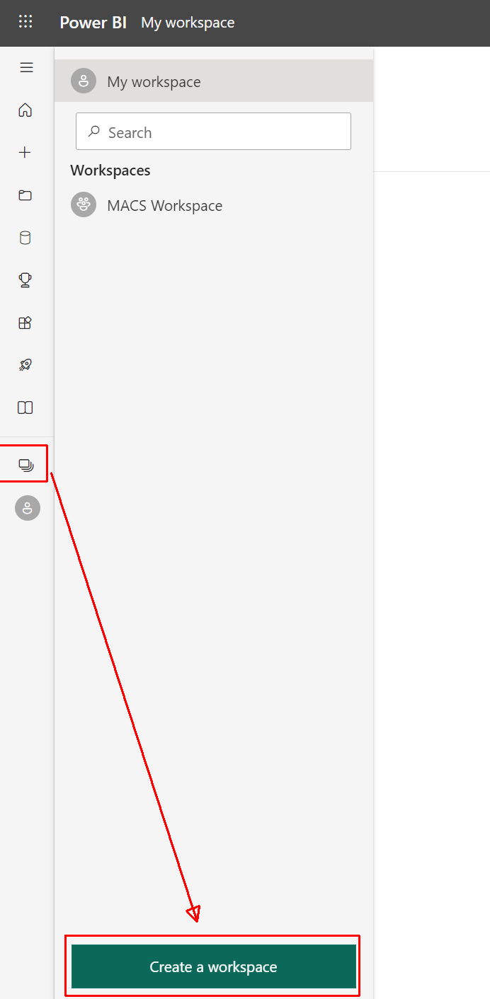
3. Create a new Dataflow
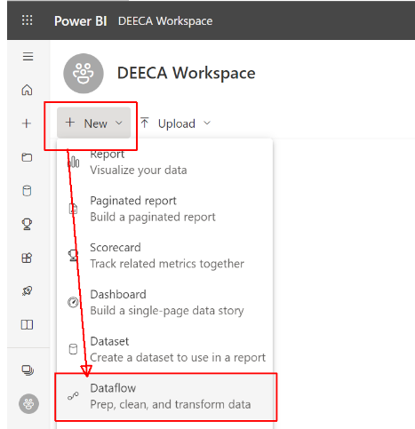
4. Click on "Add new tables"
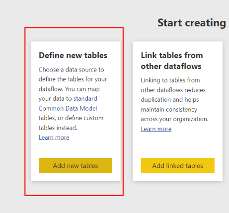
5. Choose "Azure tables" data source
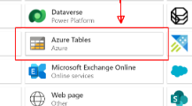
6. Paste "Storage account name" and "key1" from section 10.2 of this deployment guide and click "Next"
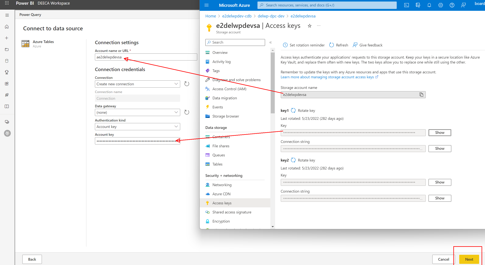
7. Select "RecordsDataForPowerBI" table from the table list and click "Transform data"
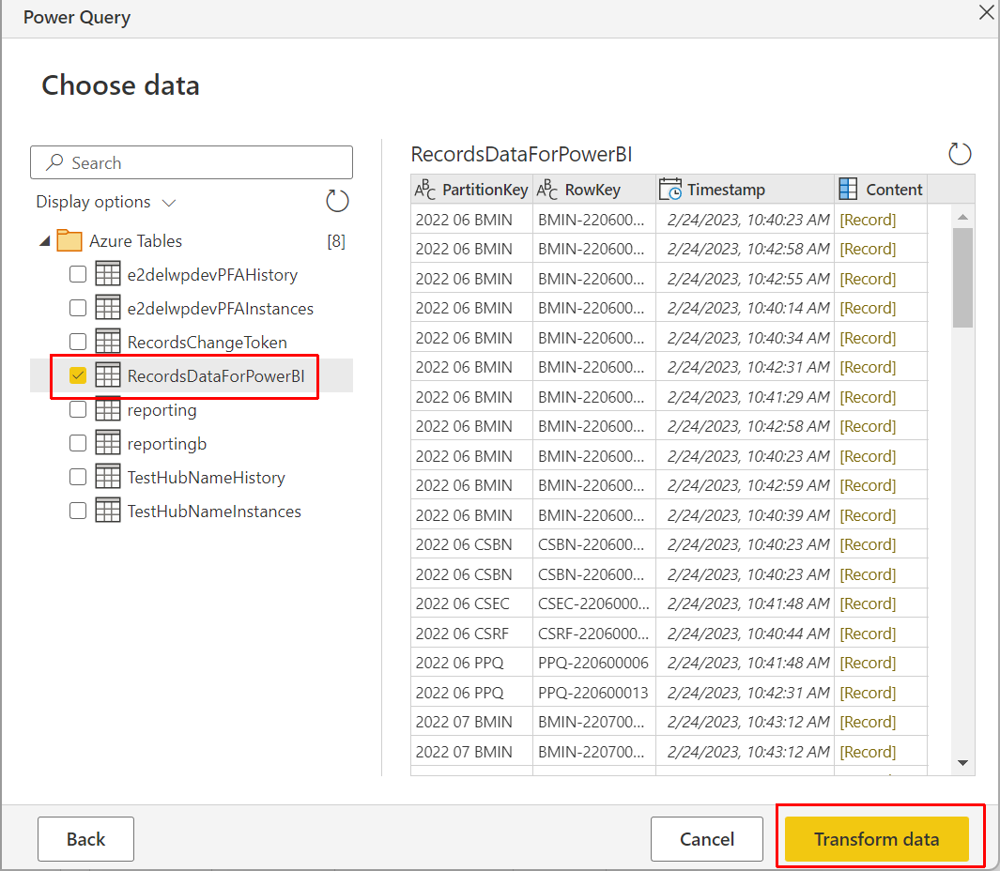
8. Click on "Expand" icon in "Content" column header and select all column. Then press "OK". Then “Save & close”. Set “BMCP – \[Environment] Dataflow” name and save it.
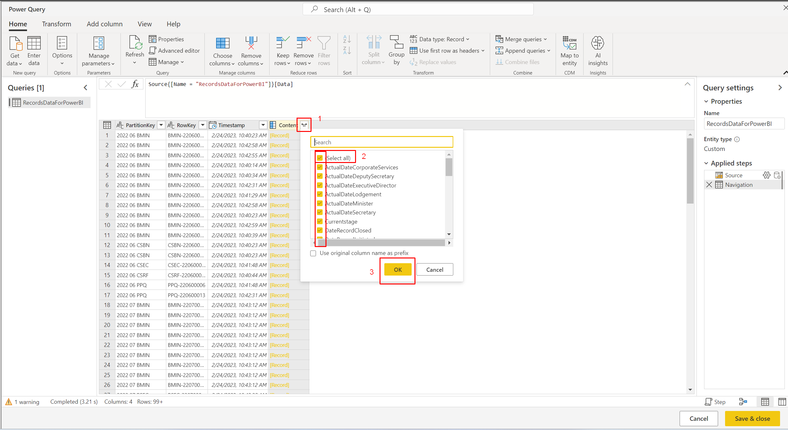
9. Close dataflow view
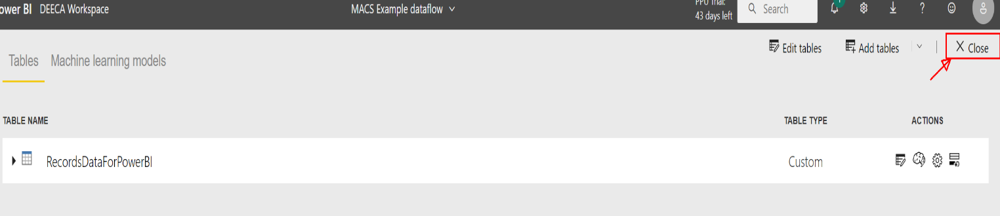
10. Click on "Refresh now" button
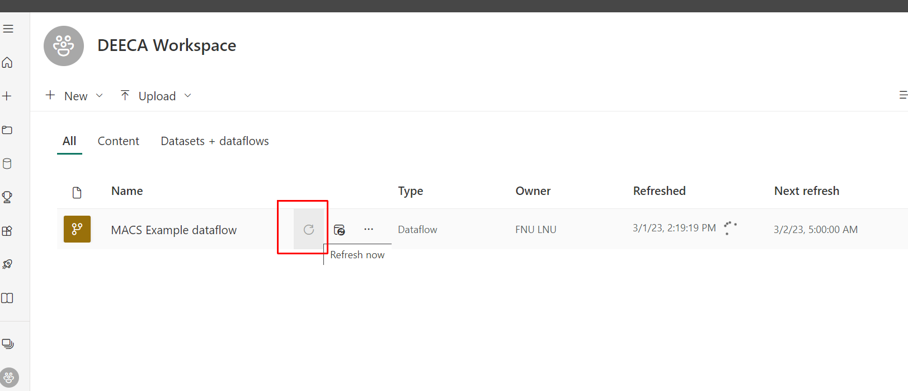
11. Choose your dataflow and click on "Schedule refresh" icon
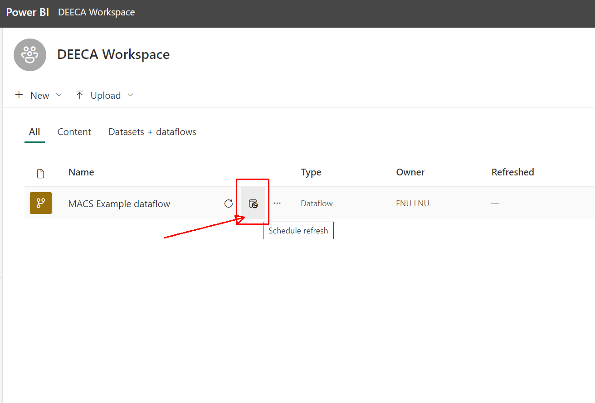
12. Set Schedule and click "Apply"
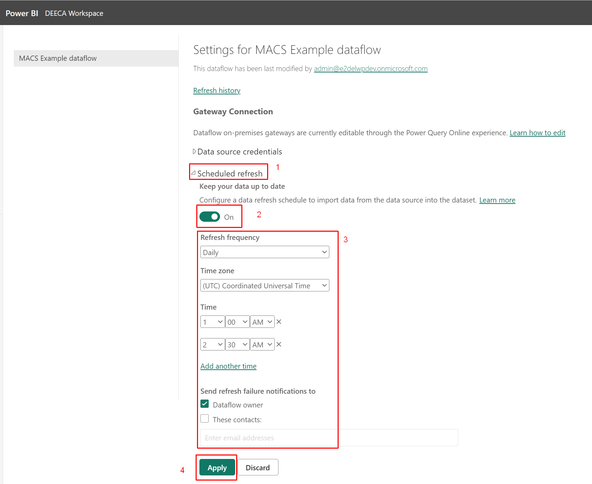

 
