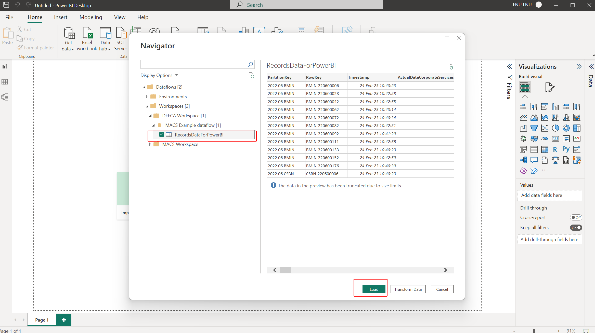
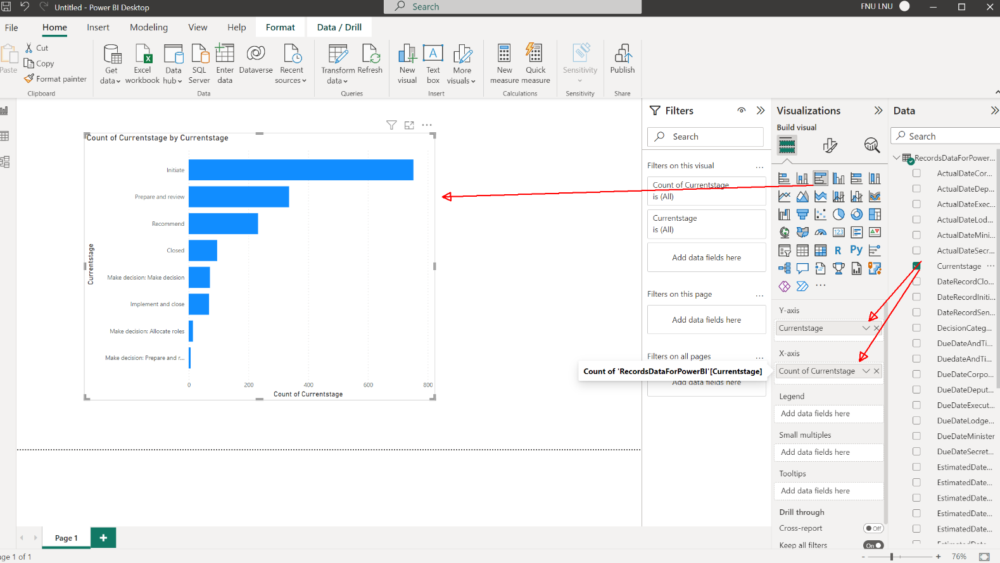
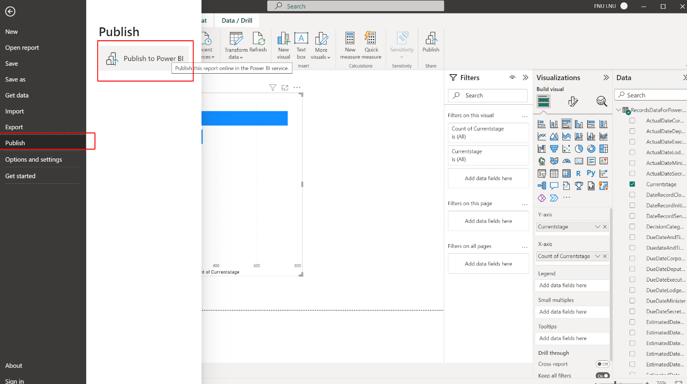
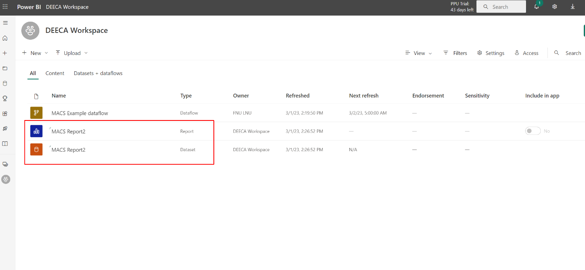

1. Open "Power BI desktop" with Service account that has access to Workspace and Dataflow
2. Click on "Get data" in ribbon and select "Dataflows"
3. Select previously created dataflow and click "Load" button.

4. Build sample report:

5. Save and publish the report

6. Now Report + Dataset can be found in Power BI web app. It can be shared with business users who should have access to it.

