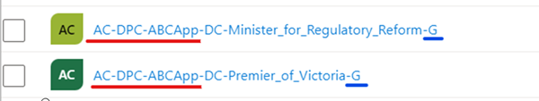

It is recommended to use the same naming conventions for all AAD groups for the given environment. Try to use same prefixes and postfix values for them. For example: SG-BMCP-\[GroupName]-UAT. Use the same values that will be specified in SecurityGroupsPrefix and SecurityGroupsPostfix values in Application config later.

Create 2 AAD Groups:
* Group for admins with “AppAdministrators” name
* Group for users who has access to the app with “AllUsers” name.

Example group naming template:
* **“AC-DPC-ABCApp-“** – Prefix
* **“-G”** - Postfix

>
