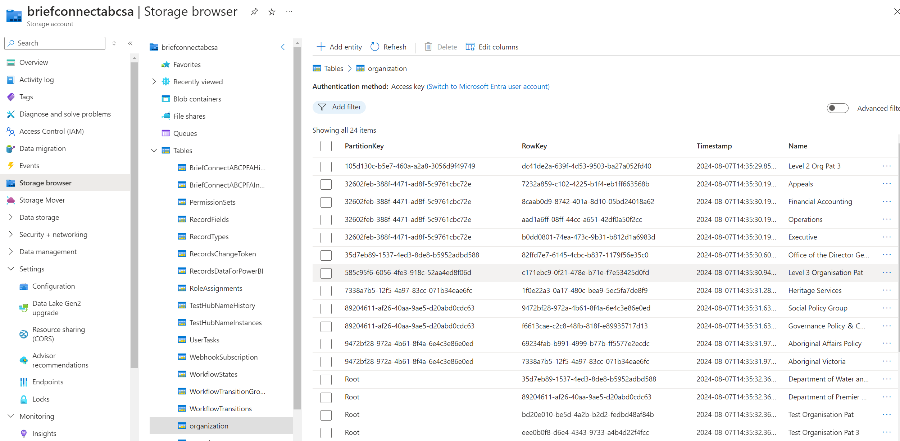

BMCP app loads Org Structure from table in Azure Storage.

Table Name: **organization**

Fields:
* **PartitionKey:** Parent Organization ID. If it is root organization, then it is "Root".
* **RowKey:** Organization ID.
* **Name:** Organization Name.

Create a table and fill it with the necessary data.

> Note: The application supports 4 levels of nesting.

Example:

> 
