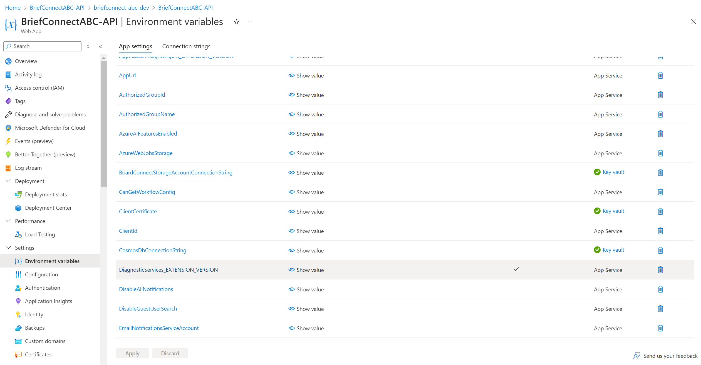

[[_TOC_]]

## 2.13.1 Configure Key Vault

Configure certificate

1. Navigate to the Key Vault
1. Click on 'Access Policies' and provide yourself with 'Get/Set' certificate permissions, Save
1. Upload the .pfx certificate file that matches the .cer certificate file that was added the server app above to the Key Vault
1. Copy the value (Example value: `@Microsoft.KeyVault(SecretUri=uri to the cert)` ) (note that the 'secret reference' not 'certificate reference' for the certificate in key vault should be used here). To get the URI click on the Thumbprint, then current version

Add API WebApp to 'Access Policies'

1. Navigate to the Key Vault
1. Click on 'Access Policies' and provide "API WebApp" with 'Get/List' certificate and Secret permissions, Save
> 

## 2.13.2 Update App settings

Some function app settings have been set automatically by the pipeline but a few remain.

For PFA Function App, click 'Configuration' in the side panel.

Create or update if necessary for each of the following:

* **ClientId**: AAD Server App ID
* **ClientCertificate**: Key Value reference from the above
* **SupportedTenantIds**: Brief Connect Tenant ID (GUID)
* **DisableAllNotifications**: Set to 'true' initially when in a production environment to avoid accidentally sending notifications to users (emails and teams activities). Update to 'false' to allow notifications to be sent to users.
* **DisableGuestUserSearch**: 'false'
* **SecurityGroupsPrefix**: "AC-BMCPApp-" for example, or other prefix value for AAD groups, can't be empty.
* **SecurityGroupsPostfix**: "-G" or other postfix value for AAD groups (environment name), can't be empty
* **AuthorizedGroupName**: AAD group for users who have access to the system. Use \[SecurityGroupsPrefix]-Users-\[SecurityGroupsPostfix] group, which should be created by "DeployAadGroups.ps1". The group also has to be added to SharePoint site visitors.
* **AuthorizedGroupId**: Id of the group AuthorizedGroupName from above.
* **FUNCTIONS\_WORKER\_RUNTIME:** dotnet
* **FUNCTIONS_EXTENSION_VERSION:** ~4
* **FUNCTIONS_INPROC_NET8_ENABLED:** 1
* **SiteUrl:** Url of the SharePoint site collection
* **EmailNotificationsServiceAccount:** UPN of a service account for sending email notifications
* **TopHeaderBannerText** – Text to show to all users of the app on top of the header, for example to clearly identify that it is a non-production environment

## 2.13.3 Authentication settings
Go to the app authentication setting, and edit settings to be the same as on the screenshot below:

## 2.13.4 .NET Version

Ensure ".NET Version" setting for PFA Function App

## 2.13.5 Update App settings for API Web App

Copy following Environment variables from PFA Azure function into API Web App:

* "AppUrl"
* "AuthorizedGroupId"
* "AuthorizedGroupName"
* "AzureWebJobsStorage"
* "ClientCertificate"
* "ClientId","CosmosDbConnectionString"
* "DisableAllNotifications"
* "DisableGuestUserSearch"
* "EmailNotificationsServiceAccount"
* "RedisCacheConnectionString"
* "Scope"
* "SecurityGroupsPostfix"
* "SecurityGroupsPrefix"
* "SiteUrl"
* "StorageAccountConnectionString"
* "SupportedTenantIds"
* "TeamsAppId"
* "TenantId"

> 