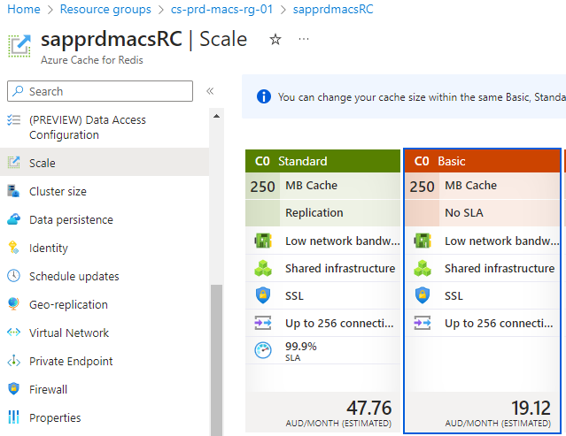

By default, Redis cache instance provisioned in Basic Tier - C0 size, as it can be upscaled, but not downscaled after it’s created.

To update the size, navigate to “Azure Cache for Redis” resource instance for the selected environment, open “Scale” for it:

> 

Change Tier and size to the next one:
* Leave Basic Tier, C0 (250MB, no SLA) size for non-production environments, to save costs as SLA is not required there.
* Change to Standard Tier, C1 (1GB, SLA 99.9%) size for production environments. *If it can’t be changed to Standard C1 from Basic C0 directly, change it to Standard C0 first, and then to Standard C1*
