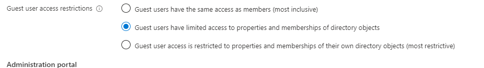

1. Sign into the Azure portal with Global Administrator permissions.
2. Browse to Azure Active Directory > User settings.
3. Under External users, select Manage external collaboration settings.
4. On the External collaboration settings page, select “Guest users have limited access to properties and memberships of directory objects”

