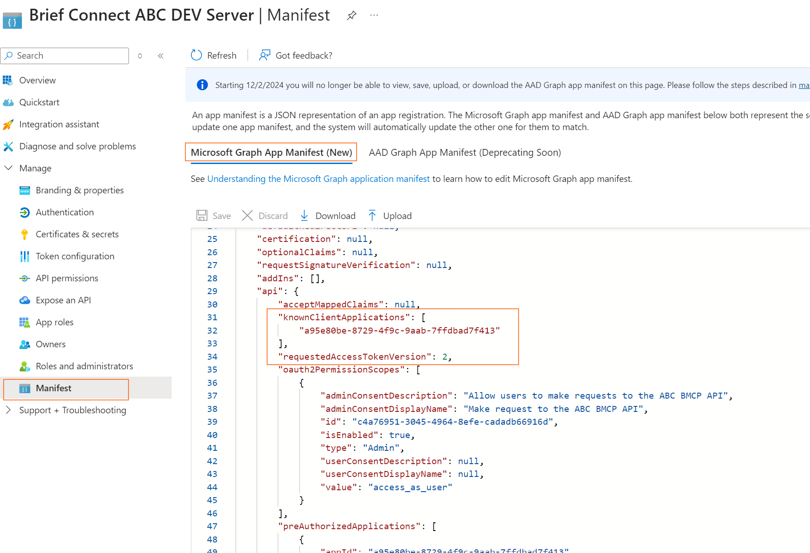

[[_TOC_]]

The following apps should be created in the same Azure tenancy in which the resources will be deployed.

## 2.5.1 DevOps App

### 2.5.1.1 Create a new AAD App

*Skip this step if you have \[EnvPrefix] eCabinet DevOps app created for Brief Connect for the same environment. Go to next "update" section.*

Create a new AAD app:

* Name: \[EnvPrefix] eCabinet DevOps
* Single – tenant
* No redirect URI

Update Authentication:

* Click "Authentication" in the side panel
* Click "Add a platform"
* Select "Web"
* Redirect URI: [https://dev.azure.com](https://dev.azure.com/)
* Check "ID tokens"

Create Client Secret:

* Click "Certificates and Secrets" in the side panel
* Description: \[EnvPrefix] eCabinet DevOps
* Expires: 24 months
* Take note of the secret - you'll need it later and it is only displayed now.

### 2.5.1.2 Update the app

Upload Certificate:

* Click "Certificates and Secrets" in the side panel
* Upload CER file generated for this app previously

Update Authentication for PnP:
* Click "Authentication" in the side panel
* Click "Add a platform"
* Select "Mobile and desktop applications"
* Select “https://login.microsoftonline.com/common/oauth2/nativeclient”
* Custom redirect URIs: http://localhost
* Click Configure

Update API Permissions:

* SharePoint, Application: Sites.Selected, TermStore.ReadWrite.All
* MS Graph, Delegated: Sites.FullControl.All
* Grant admin consent for the added permissions

## 2.5.2 Client App

Create a new AAD app registration:

* Name: \[EnvPrefix] BMCP Client
* Single – tenant
* No redirect URI (note: will provide after resources are provisioned)

Update API Permissions:

* Click "API Permissions" in the side panel
* Microsoft Graph, Delegated: email, offline\_access, openid, profile, Sites.Read.All
* These should be the only permissions granted, remove any default permissions (User.Read)
* Grant admin consent for the added permissions

 

## 2.5.3 Server App

Create a new AAD app registration:

* Name: \[EnvPrefix] BMCP Server
* Single - tenant
* No redirect URI (note: will provide after resources are provisioned)

Upload Certificate:

* Click "Certificates and Secrets" in the side panel
* Upload CER file generated for this app previously

Update API Permissions:

* Microsoft Graph, Delegated: Group.Read.All, GroupMember.Read.All, Sites.ReadWrite.All, Sites.Read.All, User.Read, User.Read.All
* Microsoft Graph, Application: Group.Read.All, GroupMember.Read.All, Mail.Send, Sites.Selected, TeamsActivity.Send, User.Read.All
* SharePoint, Delegated: AllSites.Manage, TermStore.Read.All
* SharePoint Application: Sites.Read.All, Sites.Selected
* Grant admin consent for the added permissions

Update Manifest:

* Click "Manifest" in the side panel
* Edit "knownClientApplications" such that it is an array of 1 string, being the application id of the \[ENVPREFIX] BMCP Client App Registration from above (replace nil-Id to real id value): `"knownClientApplications": ["00000000-0000-0000-0000-000000000000"],`
* Edit "requestedAaccessTokenVersion", setting its value to: 2: `"requestedAaccessTokenVersion": 2,`
> 

 
