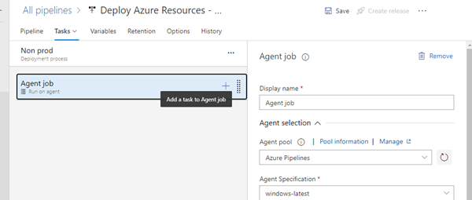
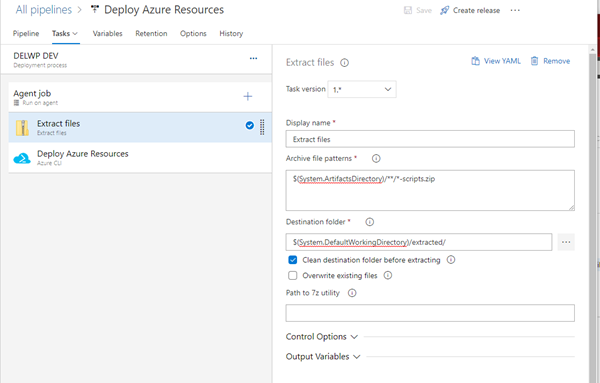
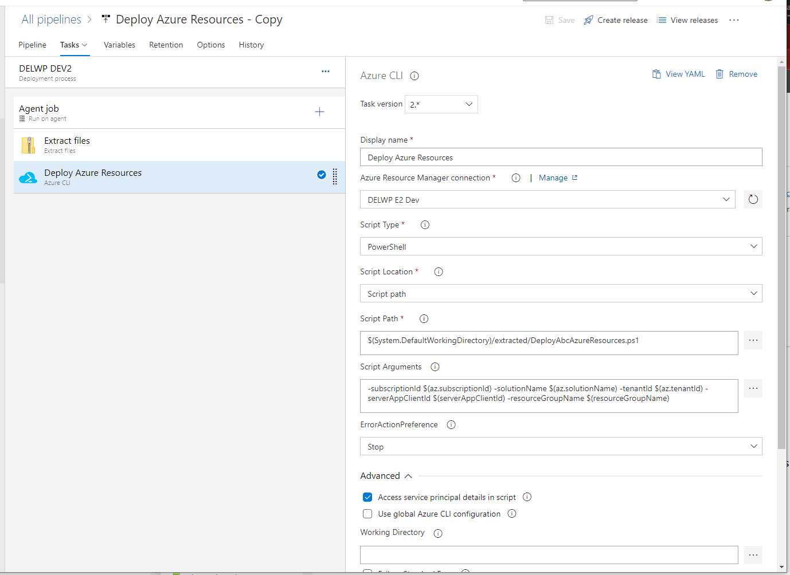

[[_TOC_]]

## 2.8.1 Set-up and run Build Pipeline

* Open the project in Azure DevOps, go to Pipelines in the left-hand navigation menu.
* Click on “New pipeline” button at the top.
* Select “Azure Repos Git (YAML)” on the “Connect” tab.
* Select “… Azure Resources” repository on the “Select” tab.
* Select “Existing Azure Pipelines YAML file” on the “Configure” tab.
* Set “/pipeline/build-pipeline.yml” value in the existing YAML file path
* Click on “Run” button on the “Review” tab step. Wait the build run until it is completed.

## 2.8.2 Set-up and run Release Pipeline

### 2.8.2.1 Create/update release pipeline

If this is the very first environment, then the release pipeline doesn’t exist, so you need to go to the next step. If it is not the first environment provisioning, then skip “Create” step and go to the “Update release pipeline” step

#### 2.8.2.1.1 Create release pipeline

* Open the project in Azure DevOps, go to Pipelines - Releases in the left hand navigation menu. Click on “New” – “New release pipeline” button.
* Do not select a Stage template in the right panel, just close it.
* Name in “Deploy BMCP Azure Resources”.
* Add an Artifact sourced from “… Azure Resources” build pipeline created earlier.
* Save it.

#### 2.8.2.1.2 Update release pipeline.

* Open “Deploy BMCP Azure Resources” release pipeline. Click on “Edit” button.
* In Stages section add a new Stage, select “Empty job” template.
* Open stage tasks.
* Name the stage with the environment name.
* In the Agent job properties select any appropriate Windows hosted agent pool.
* Add new task. Select “Extract files” task template.
> 

* Set properties to:
  * Display name: Extract files
  * Archive file patterns: $(System.ArtifactsDirectory)/\*\*/\*-scripts.zip
  * Destination folder: $(System.DefaultWorkingDirectory)/extracted/
  * Clean destination folder before extracting: checked
> 

* Add new task. Select “Azure CLI” task template. Set props to:
   * Display name: Deploy Azure Resources
   * Deploy Azure Resources: select previously created service connector
   * Script Type: PowerShell
   * Script Location: Script path
   * Script Path: `$(System.DefaultWorkingDirectory)/extracted/DeployAbcAzureResources.ps1`
   * Script Arguments: `-subscriptionId $(az.subscriptionId) -solutionName $(az.solutionName) -tenantId $(az.tenantId) -serverAppClientId $(serverAppClientId) -resourceGroupName $(resourceGroupName)`
   * ErrorActionPreference: Stop
   * Access service principal details in script: checked
> 

* Go to Variables tab, and add new variables for the newly created stage Scope:
   * `az.subscriptionId` – Azure subscription ID related to the target azure resource group
   * `az.solutionName` – the base name of the resources. See 2.3 of this instruction. Must be unique, 20 or less alphanumeric characters (a-z, A-Z, 0-9)
   * `az.tenantId` – ID of the tenant (GUID)
   * `serverAppClientId` – id of the AAD Server App created previously.
   * `resourceGroupName` – target azure resource group
