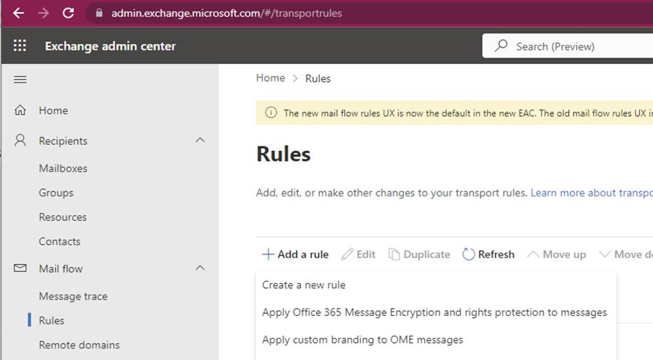
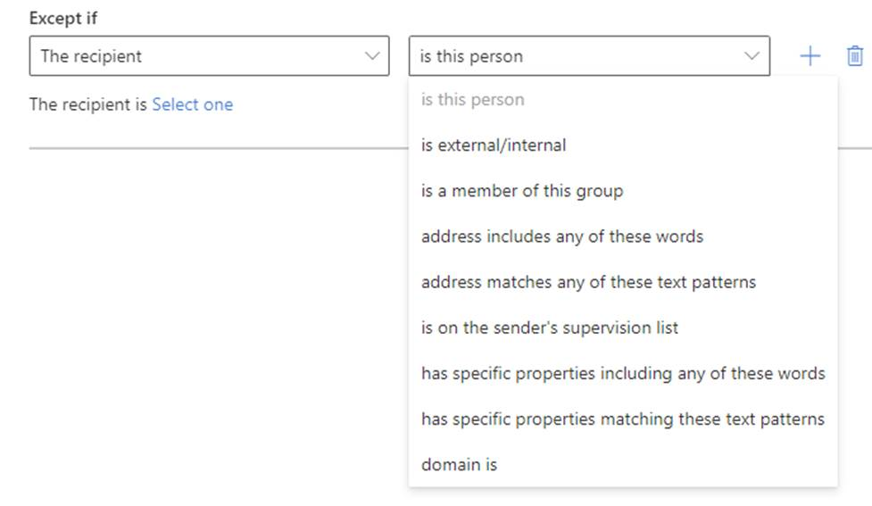
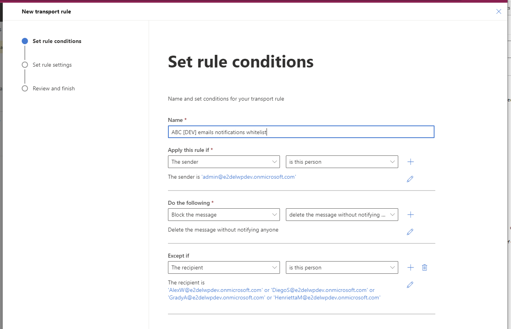
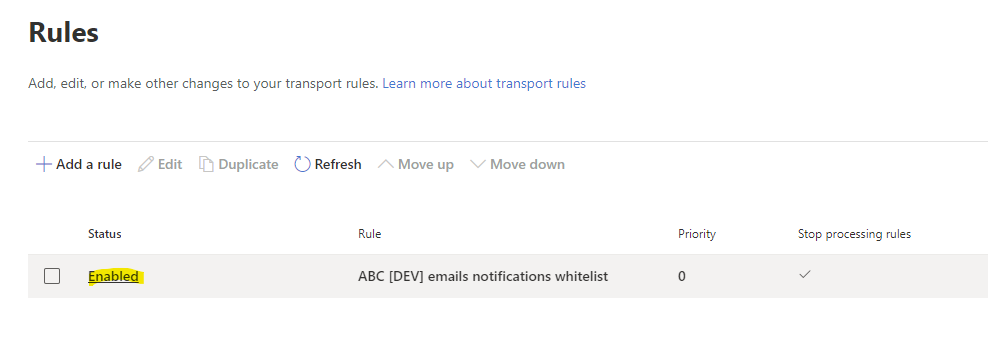

1. Using the Exchange Administrator account go to Mail Flow Rules settings page here: <https://admin.exchange.microsoft.com/#/transportrules>
1. Click on "Add a rule" button and select "Create a new rule" option. 
1. Add a new rule and set next options on "Set rule conditions" wizard page:
   * Set the name of the rule
   * Apply this rule if | The sender is this person | select the BMCP Service account
   * Do the following | Block the message | Delete the message without notifying anyone
    * Except if | The recipient | This is the option to add users from the whitelist. Select the option that **suits best for you**. Here is a rule example for DEV environment  
1. Click on "Next" button. On the "Set rule settings" select next options:
   * Rule mode: Enforce
   * Severity: Not Specified
   * Activate/Deactivate this rule on - leave unchecked and disabled
   * Check "Stop processing more rules"
   * Leave "Defer the message if rule processing doesn't complete" unchecked
   * Match sender address in message: Header or envelope.
1. Click "Next", review the rule, and click "Finish" then "Done" buttons.
1. After the rule is created you need to enable it. Find it in the list of rules and open.
1. Check "Enable or disable rule" toggle to "On" position. Refresh the page.
1. Confirm the rule has "Enabled" status in the list

> 

**Wait at least 30 minutes after creating a rule before you test it. If you test immediately after you create the rule, you may get inconsistent behaviour.**

When the rule is ready and working, make sure notifications enabled in the Azure Function App settings. Notifications should be enabled in the App Settings, as they will be filtered by the rule created above.

*DisableAllNotifications: false*

 

For more details see MS documentation here: <https://learn.microsoft.com/en-gb/exchange/security-and-compliance/mail-flow-rules/test-mail-flow-rules>
