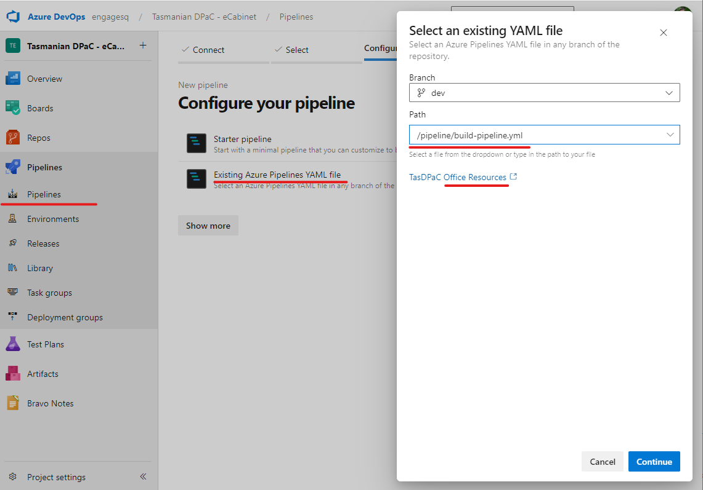

* Open the project in Azure DevOps, go to Pipelines - Pipelines in the left hand navigation menu.
* Create a new pipeline, connect it to Azure Repos Git, Select “BMCP Office Resources” repository
* Select the build-pipelines.yml file in “BMCP Office Resources” repository.

