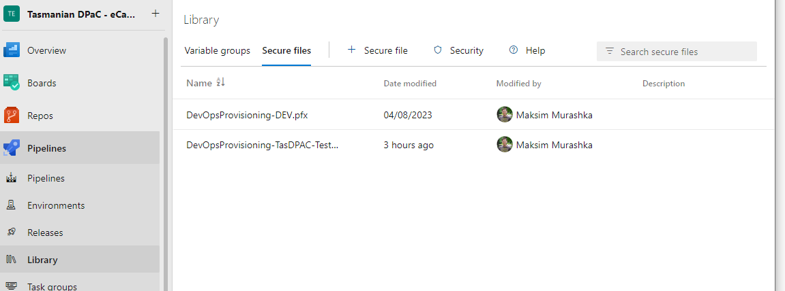
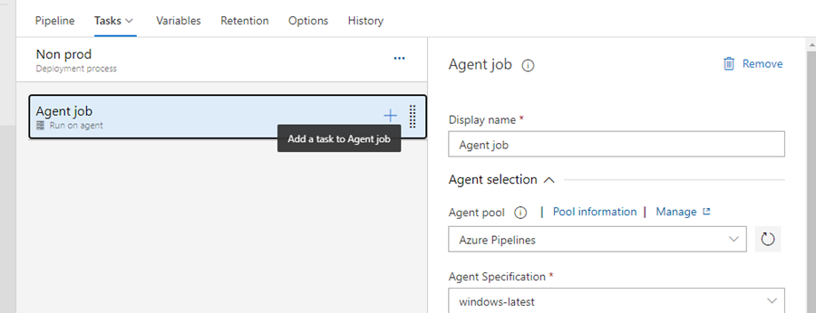
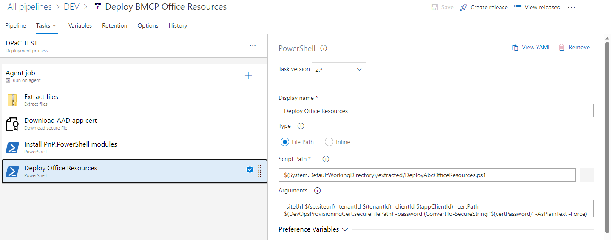
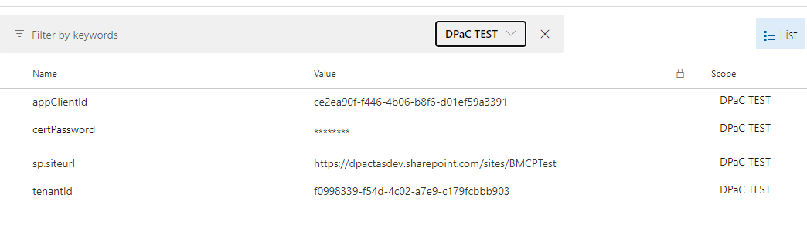

[[_TOC_]]

## 5.4.1 Create/update release pipeline

If this is the very first environment, then the release pipeline doesn’t exist, so you need to go to the next step. If it is not the first environment provisioning, then clone an existing stage, skip “Create” step and go to the “Update release pipeline” step.

## 5.4.2 Create release pipeline

* Open the project in Azure DevOps, go to Pipelines - Releases in the left hand navigation menu. Click on “New” – “New release pipeline” button.
* Do not select a Stage template in the right panel, just close it.
* Name in “Deploy Office Resources”.
* Add an Artifact sourced from “… Office Resources” build pipeline created earlier.
* Save it.

## 5.4.3 Upload a certificate

* Open the project in Azure DevOps, go to Pipelines - Library in the left hand navigation menu. Switch to Secure files tab and click on “+ Secure file” button.
> 
* Upload a pfx certificate file for DevOps AAD Application

## 5.4.4 Update release pipeline.

* Open “Deploy Office Resources” release pipeline. Click on “Edit” button.
* In Stages section clone an existing stage or add a new Stage with selecting “Empty job” template.
* Open stage tasks.
* Name the stage with the environment name.
* In the Agent job properties select any appropriate Windows hosted agent pool.
> 
* Add new task. Select “Download secure file” task template.
* Set properties to:
  * Display name: Download AAD app cert
  * Secure File: Select pfx file for the current environment
  * Output Variables - Reference name: DevOpsProvisioningCert
* Add new task. Select “Powershell” task template. Set props to:
   * Display name: Install PnP.PowerShell modules
   * Type: File Path
   * Script Path: `$(System.DefaultWorkingDirectory)/extracted/InstallModules.ps1` Script Arguments: empty
   * Select Advanced – User PowerShell Core
* Add new task. Select “Powershell” task template. Set props to:
   * Display name: Deploy Office Resources
   * Type: File Path
   * Script Path: `$(System.DefaultWorkingDirectory)/extracted/DeployAbcOfficeResources.ps1`
   * Script Arguments: `-siteUrl $(sp.siteurl) -tenantId $(tenantId) -clientId $(appClientId) -certPath $(DevOpsProvisioningCert.secureFilePath) -password (ConvertTo-SecureString '$(certPassword)' -AsPlainText -Force)`
   * Select Advanced – User PowerShell Core
>  

* Go to Variables tab, and add new variables for the newly created stage Scope:
   * appClientId – DevOps AAD App ID
   * certPassword – password for the certificate file
   * sp.siteurl – site collection url
   * sp.username – service account user name
   * tenantId – ID of the tenant where the site collection is hosted
> 

 
