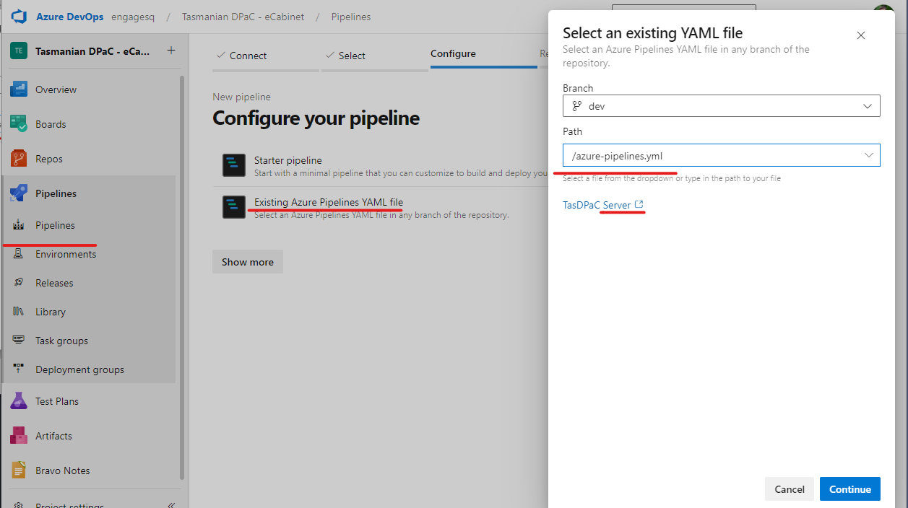

* Open the project in Azure DevOps, go to Pipelines - Pipelines in the left hand navigation menu.
* Create a new pipeline, connect it to Azure Repos Git, Select “… Server” repository
* Select the azure-pipelines.yml file in “…  Server” repository.
* Name it “Release - BMCP Server

