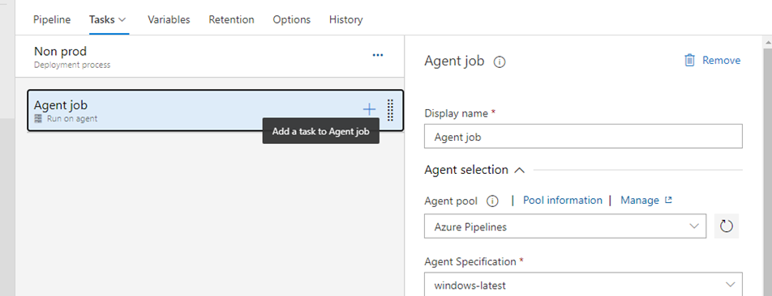
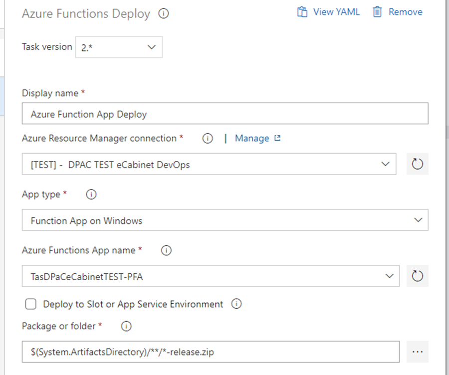
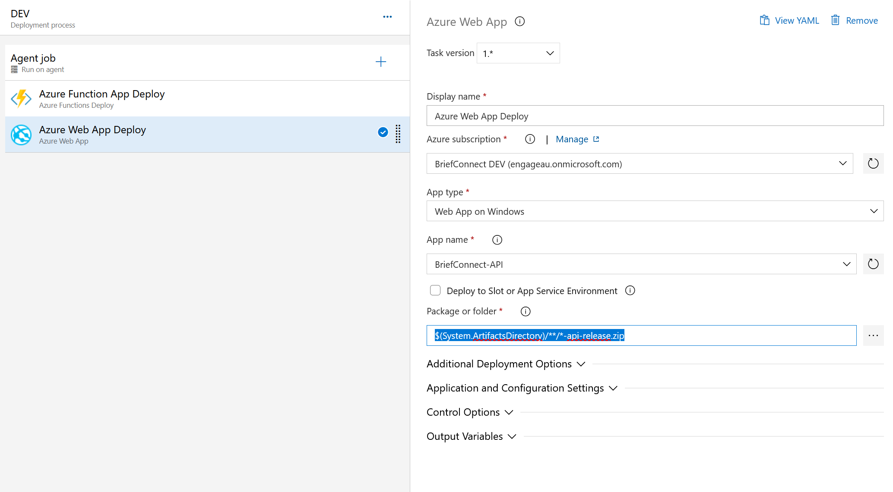

### 6.2.1.1 Create/update release pipeline

If this is the very first environment, then the release pipeline doesn’t exist, so you need to go to the next step. If it is not the first environment provisioning, then skip “Create” step and go to the “Update release pipeline” step

#### 6.2.1.1.1 Create release pipeline

* Open the project in Azure DevOps, go to Pipelines - Releases in the left hand navigation menu. Click on “New” – “New release pipeline” button.
* Do not select a Stage template in the right panel, just close it.
* Name in “Deploy Server”.
* Add an Artifact sourced from “… Server” build pipeline created earlier.
* Save it.

#### 6.2.1.1.2 Update release pipeline.

* Open “Deploy Server” release pipeline. Click on “Edit” button.
* In Stages section add a new Stage, select “Empty job” template.
* Open stage tasks.
* Name the stage with the environment name.
* In the Agent job properties select any appropriate Windows hosted agent pool.
> 
* Add new task. Select “Azure Functions Deploy” task template.
* Set properties to:
  * Display name: Azure Function App
  * Azure Resource Manager connection: select a service connection for the specific environment
  * App type: Function App on Windows
  * Azure Functions App name: \*\*\*-PFA function
  * Package or folder: $(System.ArtifactsDirectory)/\*\*/\*-release.zip

* Add new task. Select "Azure Web App Deploy" task template.
* Set properties to:
  * Display name: Azure Web App Deploy
  * Azure Resource Manager connection: select a service connection for the specific environment
  * App type: Web App on Windows
  * Azure Functions App name: \*\*\*-API
  * Package or folder: `$(System.ArtifactsDirectory)/**/*-api-release.zip`
