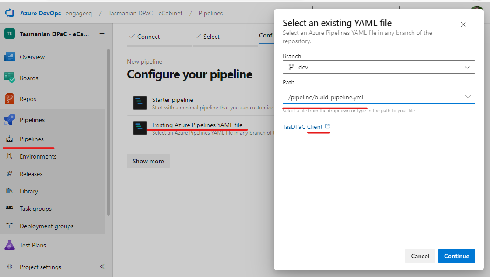

* Open the project in Azure DevOps, go to Pipelines - Pipelines
* Create pipeline from existing YAML file
* Select the pipeline/build-pipeline.yml file in “BMCP Client” repository.
* Save it with “Release – BMCP Client”

