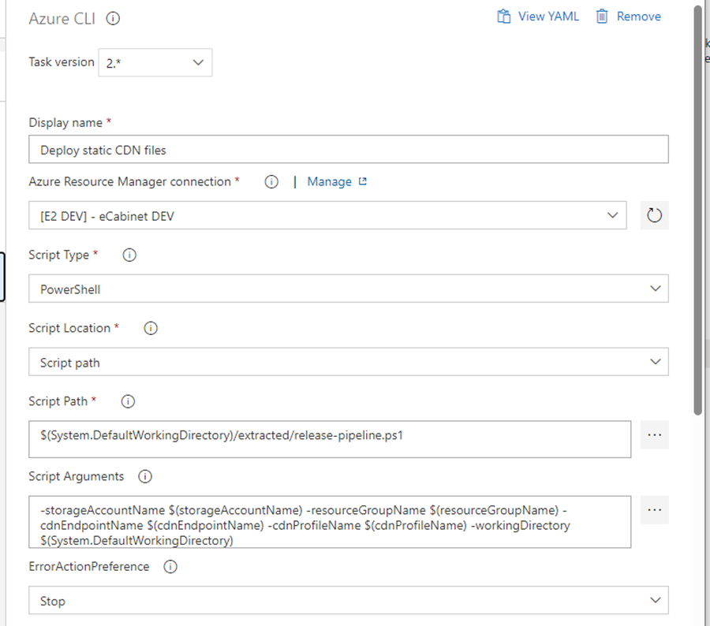

### 7.3.1.1 Create/update release pipeline

If this is the very first environment, then the release pipeline doesn’t exist, so you need to go to the next step. If it is not the first environment provisioning, then skip “Create” step and go to the “Update release pipeline” step

#### 7.3.1.1.1 Create release pipeline

* Open the project in Azure DevOps, go to Pipelines - Releases in the left hand navigation menu. Click on “New” – “New release pipeline” button.
* Do not select a Stage template in the right panel, just close it.
* Name in “Deploy BMCP Client”.
* Add an Artifact sourced from “Release – BMCP Client” build pipeline created earlier.
* Save it.

#### 7.3.1.1.2  Update release pipeline.

* Open “Deploy Client” release pipeline. Click on “Edit” button.
* In Stages section add a new Stage, select “Empty job” template.
* Open stage tasks.
* Name the stage with the environment name.
* In the Agent job properties select any appropriate Windows hosted agent pool.
* Add new task. Select “Extract files” task template.

* Set properties to:
  * Display name: Extract files
  * Archive file patterns: $(System.ArtifactsDirectory)/\*\*/\*-build.zip
  * Destination folder: $(System.DefaultWorkingDirectory)/web/
  * Clean destination folder before extracting: checked
* Add new task. Select “Extract files” task template. Set props to:
* Set properties to:
  * Display name: Extract scripts
  * Archive file patterns: $(System.ArtifactsDirectory)/\*\*/\*-release-script.zip
  * Destination folder: $(System.DefaultWorkingDirectory)/extracted/
  * Clean destination folder before extracting: checked
* Add new task. Select “PowerShell” task template. Set props to:
* Set properties to:
  * Display name: Create environment config file
  * Type: Inline
  * Script: `New-Item -Path "$(System.DefaultWorkingDirectory)/web/" -Name "config.json" -Value '$(configJSON)' -Force`
> 

* Add new task. Select “Azure CLI” task template. Set props to:
  * Display name: Deploy static CDN files
  * Azure Resource Manager connection:  select a service connection for the specific environment.
  * Script Type: PowerShell
  * Script Location: Script path
  * Script Path: `$(System.DefaultWorkingDirectory)/extracted/release-pipeline.ps1`
  * Script Arguments: `-storageAccountName $(storageAccountName) -resourceGroupName $(resourceGroupName) -cdnEndpointName $(cdnEndpointName) -cdnProfileName $(cdnProfileName) -workingDirectory $(System.DefaultWorkingDirectory)`
  * ErrorActionPreference: Stop
> 

* Go to Variables tab, and add new variables for the newly created stage Scope:
   * cdnEndpointName – CDN endpoint name (xxxx-CDNe)
   * cdnProfileName – CDN profile name (xxxx-CDNp)
   * resourceGroupName – azure rersource group name
   * storageAccountName – storage account name
   * configJSON – JSON value from “Client Configuration JSON” section

