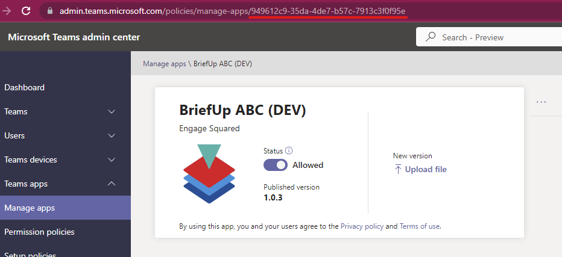

For PFA Function App and for API Web App

* Click 'Environment variables' in the side panel
* Create a 'New' for each of the following, or update existing:
  * TeamsAppId: Id of the teams app after installation. You can find it in Teams Admin center, in the browser url, when the app is opened:

