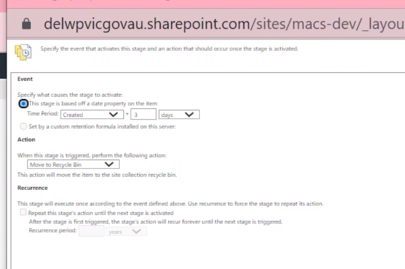

Using Admin/User guide, validate/set-up next areas for the new environment:
* Update Header Links using Header Links list on the SharePoint site.
* Setup correct proxies for users using Proxy Users list.
* Update Public Holidays in related list.
* Add/update document templates in Document Templates library
* Update user’s membership:
   * Site admins
   * “All users” group
* Apply an appropriate disposition policy on the personal storage library
  * Activate site collection feature “Library and Folder Based Retention”
  * Apply t+3d for Document

* Add placeholder document template “Empty Template” for all record types (select all 2nd level terms) in Document Templates library, including the PPO advice coversheet (2 empty documents, with the same metadata, but Template Type field)

