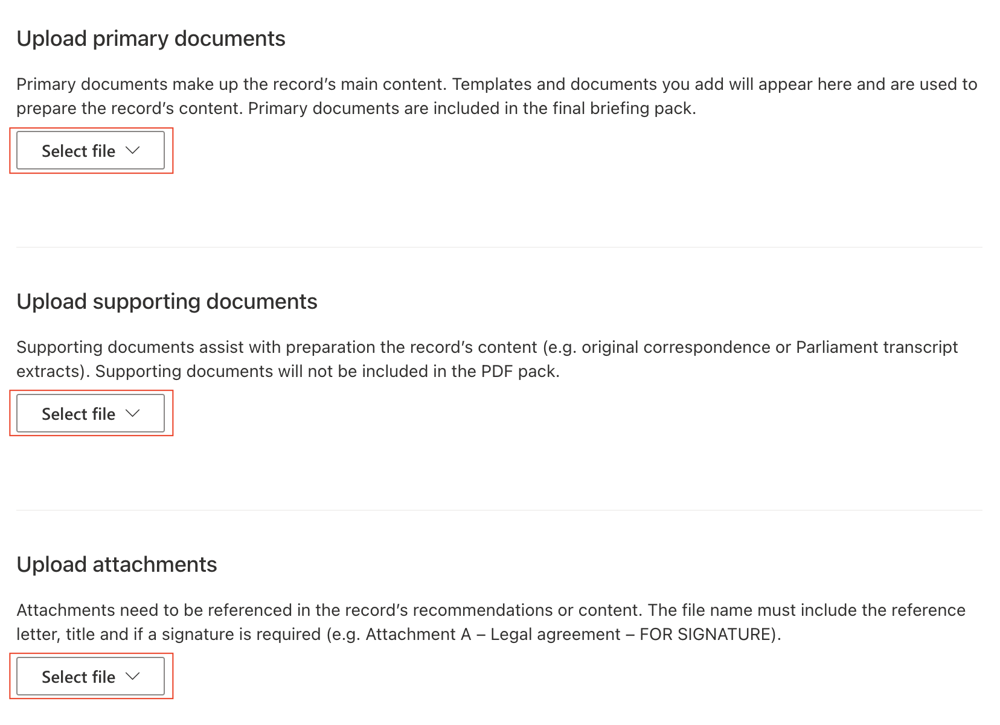
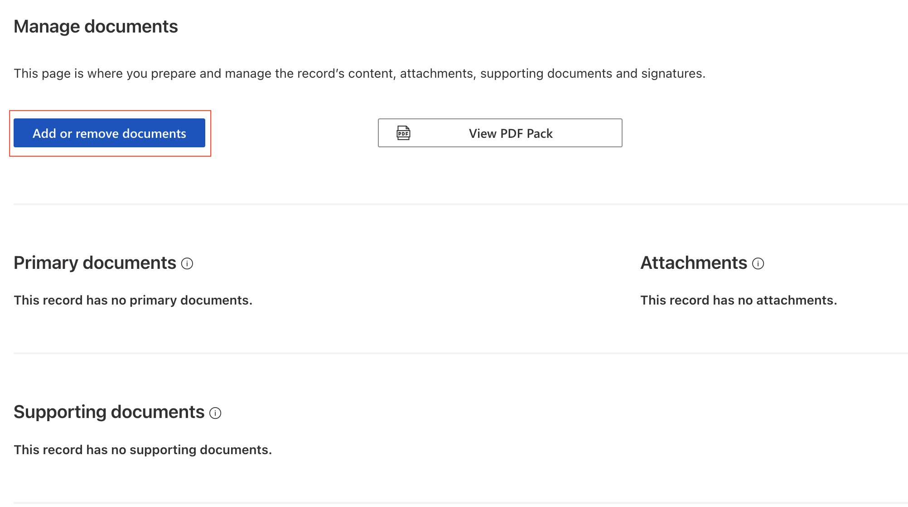

Users can attach documents both during record creation and when modifying existing records.

There are three categories to which users can attach documents:

- Attachments
- Primary Documentation
- Supporting Documentation.

To upload documents when creating a new record, users must go to the step 'Add templates and documents', scroll down to the appropriate section, press the 'Select file' dropdown, and choose whether to select a file from their drive or SharePoint Online.

To upload a document when modifying a record, users must navigate to the 'Documents' tab and press the 'Add or remove documents' button.

Depending on their needs, they should press the 'Select file' dropdown under the appropriate heading and choose whether to select a file from their drive or SharePoint Online.

# SharePoint Online File Limitations

When attaching files to records the files are stored in SharePoint Online. Please note the following SharePoint Online limitations:

## File Size Limits
- Individual file size limit: 250 GB
- Recommended upload size for optimal performance: Less than 100 GB

## Supported File Types
SharePoint Online supports most file types, including but not limited to:
- Documents (DOC, DOCX, PDF, XLS, XLSX, PPT, PPTX)
- Images (JPG, JPEG, PNG, GIF)
- Video files (MP4, MOV)
- Audio files (MP3, WAV)

## Restricted File Types
The following file types are blocked for security reasons:
- Executable files (.exe, .com, .bat, .cmd)
- Script files (.js, .vbs)
- Database files (.mdb)

## File and Folder Name Restrictions
- Cannot use: " * : < > ? / \ |
- Names cannot begin or end with a period (.)
- Maximum file path length: 400 characters
- Maximum file name length: 260 characters

For more detailed information, please refer to [Microsoft's official documentation on SharePoint limitations](https://support.microsoft.com/en-us/office/restrictions-and-limitations-in-onedrive-and-sharepoint-64883a5d-228e-48f5-b3d2-eb39e07630fa#individualfilesize).