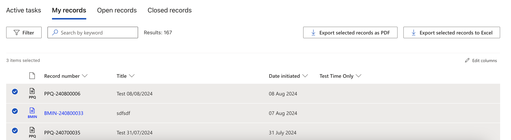

Users can export records they have access to from the Brief Connect Dashboard. The supported export formats are PDF and CSV.

###Exporting Records to PDF
- Select the record(s) you want to export.
- Press 'Export selected records as PDF'.
- Confirm by pressing the 'Submit' button.
- The generated file will be emailed to your email address within a few minutes.

###Exporting Records to CSV
- Select the record(s) you want to export.
- Press 'Export selected records as Excel'.
- Select the columns you want to include in your export.
- Press the 'Generate file' button.
- Wait until you see the 'Open file' button.
- Press the 'Open file' button.