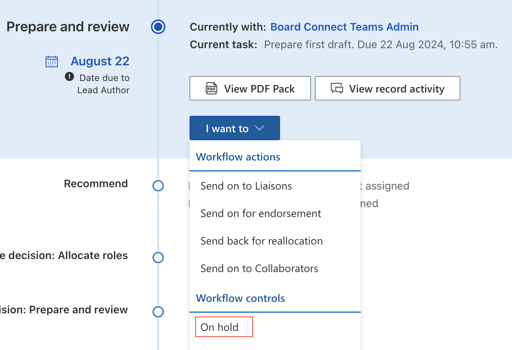
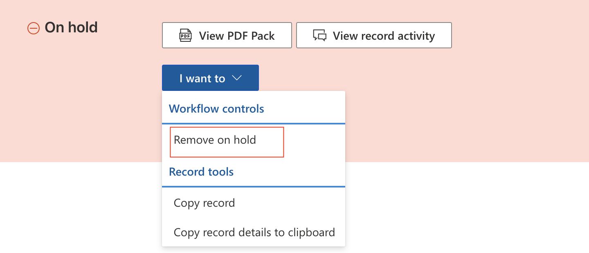

##Place a record on hold

Click I want to button > **Mark as ‘On hold’**. Enter the reason why the record is being put on hold and click Save.

Ensure you update the record’s due dates so it’s not incorrectly listed as overdue. 

##Release a record from hold

To release a record that is on hold, click I want to > **Release from hold**.   

##Mark as ‘No further action’

Records that have progress past the initiate stage but are no longer needed can be marked as ‘No further action’. This will **permanently** close the record.

To mark a record as ‘No further action’, click I want to > Mark as ‘No further action’.  