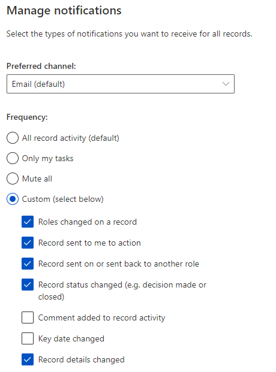
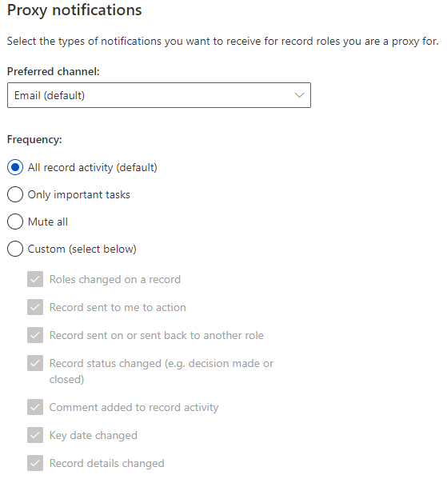
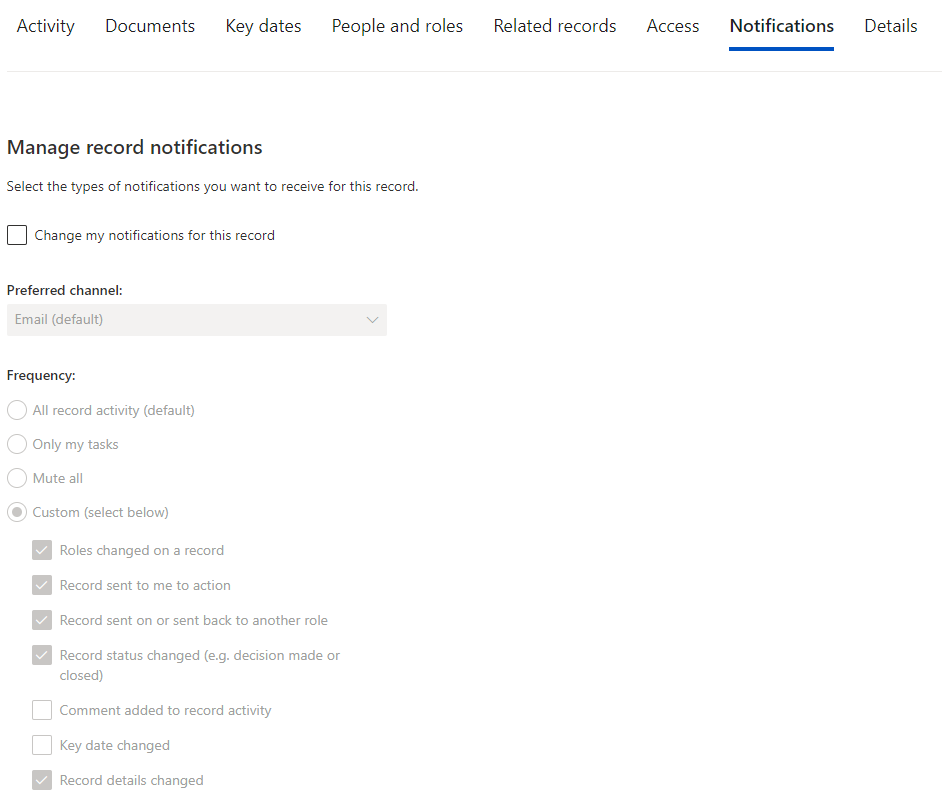

##Notifications
By default, Brief Connect will send you an email notification for all record activity for every record on which you have a role. You can customise the notification you receive for all records, or just individual records.

To change your notification for all records: 
- Click Settings cog in the top right menu. 
- Under Preferred channel, select if you want to receive the notifications via email or Teams (notifications will appear in your Teams’ activity feed). 
- Under Frequency, select what criteria you want to receive notifications for 

- Scroll down and click Save. 

###You can set up different settings for you proxy notifications.

###Notifications for individual records
- You can customise notifications for individual records by opening the record and selecting notifications under the Notifications tab.

