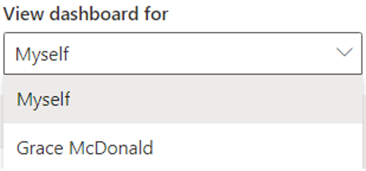
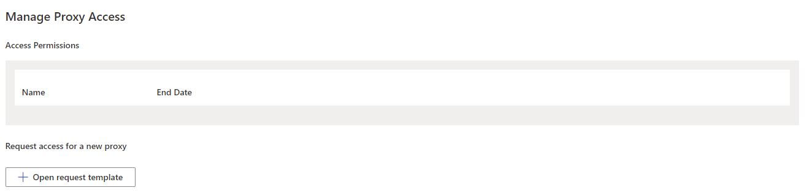
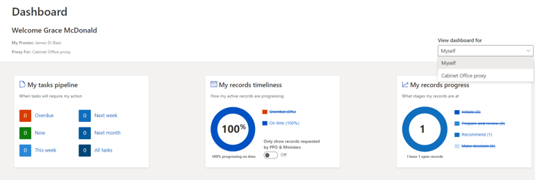

##What is a proxy?

A Proxy actions tasks on behalf of a related role/person. Proxies have the same access and permissions as their related role/person and will receive a copy of their notifications. 

###Who should use a Proxy?

Proxies will commonly be used by Ministers, however all staff are able to use this feature to facilitate flexible working, such as job-sharing arrangements. 
It’s important that anyone requesting a proxy understands that proxies can act on their behalf and have access to all records they have access to.  

- It’s important that anyone requesting a proxy understands that proxies can act on their behalf and have access to all records they have access to. 
- Once a proxy is allocated their end date can be amended or they can be completely removed through “manage proxy settings” under the settings cog.
- Proxy access is not inherited (e.g. your Proxy cannot access the records of anyone to whom you are Proxy). 
- Roles can have more than one Proxy, and proxies can have more than one related role. 

Example of how to select whether to view dashboard as yourself or your related person. All users/roles who you are a proxy for will appear in list format.

###Assign a proxy
Only the person requesting a Proxy can submit a request (it cannot be done on behalf of someone). 

- Click Settings cog in the top right corner of the dashboard screen
- Scroll down to Manage Proxy Access and click Open request template. This will open a populated email template. 

- Enter the name of the person you want to add as your Proxy where is says [user] and the date you want their Proxy access to end. 
- You may need to add the email into the To field xxx@microsoft.com
- Click Send.
- Your request will be sent to Brief Connect Administrators via email to action. You’ll be notified once it’s complete. 

###Act as a proxy
Once a proxy is assigned their dashboard view will include a new feature called view dashboard for. 

To switch between profiles:
- Click the drop-down arrow under View dashboard for
- From the list select the desired role / person

- The dashboard will change views and field updated. This is often most apparent in the snapshot numbers.
- Perform activities as required. Once complete return to ‘view dashboard for’ box and amend the selection
