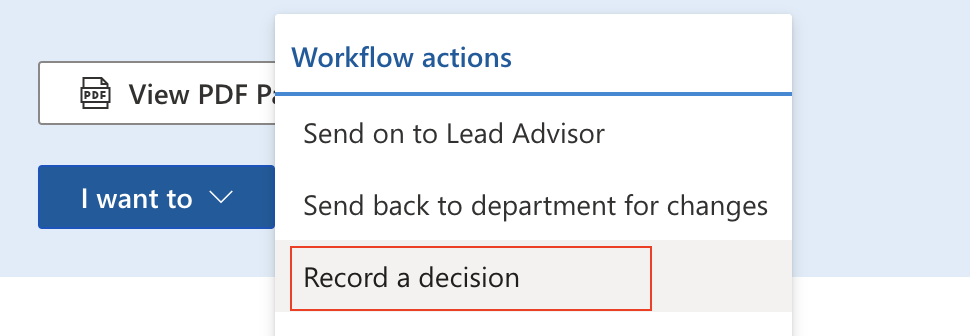
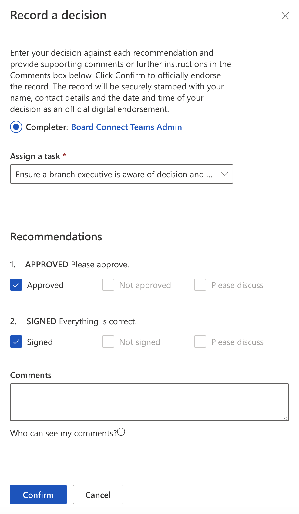

Decision Makers can record a decision based on the provided information, documentation, and recommendations.

To record a decision, users must click the 'I want to' dropdown and select 'Record a decision'.

Under 'Recommendations', users must select the decision against each recommendation.

Once a decision is selected, users can provide a comment before pressing the 'Confirm' button.